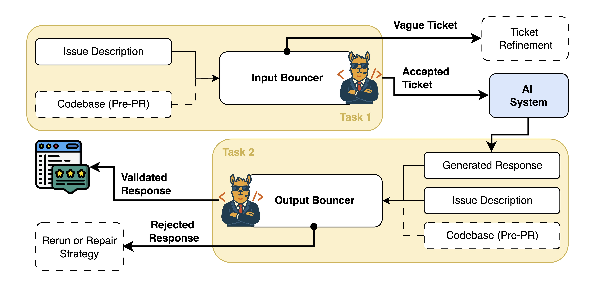

#  BouncerBench
<div align="center">
  
[](https://wwww.bouncerbench.com)
<!-- [](https://arxiv.org/abs/_) -->
[](https://huggingface.co/collections/uw-swag/bouncerbench-68570e7beb2f154502a92286)

</div>
> [!NOTE]
> BouncerBench Multilingual with additional tasks to cover more programming languages and ticket types will be released soon!

> [!IMPORTANT]
> To make a submission to the BouncerBench Leaderboard, please follow this [README](https://github.com/swag/BouncerBench/blob/submission/README.md).

## Sometimes no answer is better than a wrong one!

BouncerBench is a benchmark for evaluating the ability of Large Language Models (LLMs) to abstain when presented with ambiguous tasks or when a sufficiently accurate response cannot be provided. 
Trust and reliability are critical to the success of AI agents in software engineering tasks, and BouncerBench introduces a notion of "bouncers" that could be applied to any autonomous ticket resolution system.



## BouncerBench Replication Instructions

### Setup Environment

We will use venv to create a virtual environment for this project. Make sure you have `python` and `pip` installed, the following steps assume you have Python 3.10 or later and a Linux environment.

```bash
# Create a virtual environment
python -m venv venv
# Activate the virtual environment
source venv/bin/activate
# Install the required packages
pip install -r requirements.txt
```

#### Create a `.env` file

Create a `.env` file in the root directory of the repository with the following content:

```env
ENDPOINT_URL="https://xyz.openai.azure.com/"
AZURE_OPENAI_API_KEY="xyz"
OPENROUTER_API_KEY="sk-xyz"
OLLAMA_ENDPOINT="http://xyz:11434"
```

Make sure to replace the values with your actual API keys and endpoint URLs. If you are not using a provider, you can leave the placeholders as they are.

#### Setup Codex CLI

```bash
npm install -g @openai/codex
```

Edit the `codex` config file located at `~/.config/codex/config.json` to include your OpenAI API key:
In our case since we use Azure OpenAI, the config file would look like this:

```json
{
    "model": "o4-mini",
    "provider": "azure",
    "providers": {
        "azure": {
            "name": "AzureOpenAI",
            "baseURL": "https://xyz.azure.com/openai",
            "envKey": "AZURE_OPENAI_API_KEY"
        }
    }
}
```
Please refer to the [Codex CLI documentation](https://github.com/openai/codex) for more details on how to configure the CLI.

### Fetching latest SWE-Bench Submissions (Optional)

    This can take a few hours / reasonable amount of disk space, you may skip this step and use the pre-fetched data in this repository. "all_patches.csv" contains all patches from every submission to SWE-Bench considered in the paper (Until April 4th 2025)

NOTE: The following steps will overwrite the "./data/all_patches.csv" file with newer data than we considered (if it exists).

SWE-Bench submissions are saved to a public s3 bucket. You need to configure AWS CLI with your credentials to access the bucket as described in the original SWE-Bench [Experiments Repo](https://github.com/SWE-bench/experiments?tab=readme-ov-file#-viewing-logs-trajectories)

To fetch submissions to all SWE-Bench Leaderboards, run the following commands:

```bash
# Clone SWE-Bench Experiments repository to ../experiments
git clone https://github.com/SWE-bench/experiments.git ../experiments
cd ../experiments
# Fetch all submissions (requires AWS CLI configured)
python -m analysis.download_logs evaluation/verified --skip_existing --only_log
python -m analysis.download_logs evaluation/lite --skip_existing --only_log
python -m analysis.download_logs evaluation/test --skip_existing --only_log
# switch back to the root of this repository
cd -
```

Fetching all submissions can take a while and consumes around 5.4GB of disk space (excluding trajectories using `--only_log`).

Now we can recreate `./data/all_patches.csv` file by collecting required data from the fetched submissions at "../experiments":

```bash
python 0_process_experiments.py
```

### Fetching Annotation Data (Optional)

The annotation data is already included in this repository, but if you want to fetch the latest annotations, you can do so from [OpenAI SWE-Bench Annotations](https://cdn.openai.com/introducing-swe-bench-verified/swe-bench-annotation-results.zip).
After downloading and extracting the zip file, move "ensembled_annotations_public.csv" to the "./data" directory.

### Construct BouncerBench
#### BouncerBench - Input Tasks

Run all cells in `1_create_input_dataset.ipynb` to construct the BouncerBench dataset. This notebook will create `./dataset/input_bouncer.csv` file, which contains the input tasks for BouncerBench.

#### BouncerBench - Output Tasks

Run all cells in `2_create_output_dataset.ipynb` to construct the output tasks for BouncerBench. This notebook will create `./dataset/random_sample_bouncer.csv` file, which contains the output tasks for BouncerBench.

#### BouncerBench Lite

Run all cells in `3_create_bouncerbench_lite.ipynb` to construct the BouncerBench Lite dataset. This notebook will create `./dataset/bouncer_bench_lite.csv` file, which contains the BouncerBench Lite dataset.

## Run Bouncer Experiments

Please update the `model_list` variable in `4_simple_bouncer_experiments.py` to reflect the providers you want to use for the experiments. The default is set to use the same configuration we ran experiments with (Azure for OpenAI models, Ollama for open models, and OpenRouter for Anthropic models).

Note: The exact prompts used can be found in the `prompts` directory.

### Core Experiments

The script can be run as follows:

```bash
# Run input bouncer experiments
python 4_simple_bouncer_experiments.py --input
# Run output bouncer experiments
python 4_simple_bouncer_experiments.py --output
# add the --codex flag to run the experiments using the Agentic Bouncer (Codex CLI)
python 4_simple_bouncer_experiments.py --input --codex
python 4_simple_bouncer_experiments.py --output --codex
```

The outputs will be saved to `./outputs/` directory. We have already included the outputs for the core experiments in this repository, so you can skip running these commands if you just want to view the results.

Naming Scheme for the output files: 
input_bouncer_{USED_MODEL}.json: Contains traces for the input bouncer experiments.
output_bouncer_{USED_MODEL}.json: Contains traces for the output bouncer experiments.

### Custom Agent Submission Experiments (Table IV in the paper)

To run the agent experiments, you first need to create the corresponding output bouncer datasets (with patches only from a certain submission).

```bash
python 5_create_agent_output_dataset.py
```
This shoudld create the `./dataset/agent_output/` directory with the following files:

```bash
.
 ─ agent_output
│    ─ OpenHands_bouncer.csv
│    ─ amazon-q_bouncer.csv
│   └── sweagent_bouncer.csv
```

You can then run the agent experiments as follows:

```bash
python 4_simple_bouncer_experiments.py --agents
```

This will run the experiments for the custom agents and save the outputs to `./outputs/` directory with the following naming scheme:
agent_output_bouncer_codex_{AGENT_NAME}.json

Note: for this experiment, the best input bouncer 
```python
selected_input_bouncer = "outputs/input_bouncer_o4-mini.json"
```
and the best output bouncer (Codex CLI Agent) is used. Only the output bouncing needs to be rerun due to the different patches to be evaluated.

## Analysis Scripts

We have included several scripts to analyze the results of the experiments and visualize the data.

 ─ agent_use.py: Gives insights about tool calling usage by the agents. Also looks at flips in decisions between o4-mini and codex experiments.

 ─ agreement.py: Analyzes the agreement between different models and the human annotators for input bouncing.

 ─ construct_sankey.py: Creates the Sankey diagram in Fig.4 to visualize the flow of BouncerBench Lite tickets with both input and output bouncing.

 ─ impact_of_issue_length.py: Used to construct Fig.2

 ─ impact_of_patch_length.py: Used to construct Fig.3

 ─ process_agents.py: Used to collect data for Table IV from evaluatable instances in each of the 3 submissions analyzed.

 ─ process_results.py: Computes classwise Precision, Recall, F1 for the input and output bouncing experiments.